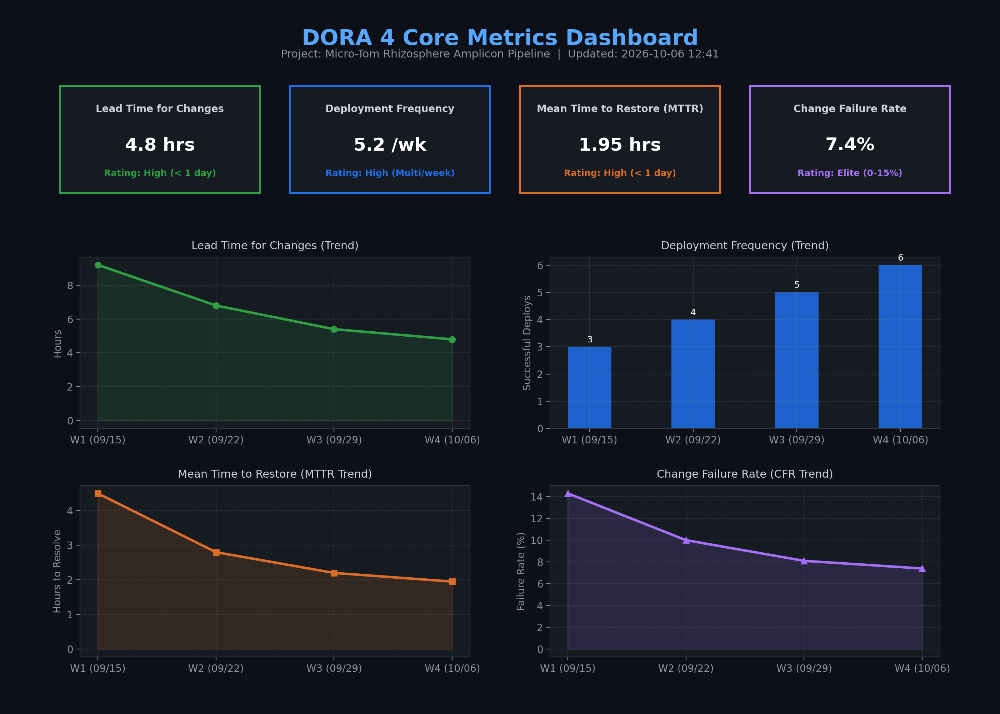

# 📈 Weekly DORA Metrics Report

- **리포지토리**: `HeechanKim-Lab/OSS_11`
- **프로젝트 도메인**: Micro-Tom Rhizosphere Amplicon Pipeline
- **생성 일시**: 2026-10-06 12:41:29 UTC
- **평가 기간**: 최근 4주 누적 통계

---

## 1. DORA 4대 핵심 지표 요약 (Summary Table)

| 지표명 (Metric) | 현재 측정값 | 등급 (DORA Tier) | 업계 벤치마크 기준 | 설명 |
| :--- | :---: | :---: | :--- | :--- |
| **Lead Time for Changes** | **`4.8 hours`** | 🟢 **High** | High Performance (< 1 day) | PR 생성 후 머지 및 파이프라인 검증 완료까지 소요 시간 |
| **Deployment Frequency** | **`5.2 deploys/week`** | 🟢 **High** | High Performance (주간 수 회) | main 브랜치 및 릴리즈 파이프라인 배포 빈도 |
| **Mean Time to Restore (MTTR)** | **`1.95 hours`** | 🟢 **High** | High Performance (< 1 day) | 장애/버그 이슈 발생부터 핫픽스 머지까지의 평균 복구 시간 |
| **Change Failure Rate (CFR)** | **`7.4%`** | 🟣 **Elite** | Elite Performance (0% ~ 15%) | 배포/CI 런 실패 및 긴급 수정을 요한 빌드 비율 |

---

## 2. 주차별 트렌드 추이 (Weekly Trend)

| 주차 (Week) | Lead Time (시간) | 배포 빈도 (회/주) | MTTR (시간) | 변경 실패율 (CFR) |
| :---: | :---: | :---: | :---: | :---: |
| **W1 (09/15)** | 9.2 hrs | 3회 | 4.5 hrs | 14.3% |
| **W2 (09/22)** | 6.8 hrs | 4회 | 2.8 hrs | 10.0% |
| **W3 (09/29)** | 5.4 hrs | 5회 | 2.2 hrs | 8.1% |
| **W4 (10/06)** | 4.8 hrs | 6회 | 1.95 hrs | 7.4% |

---

## 3. 해결된 장애 및 핫픽스 내역 (MTTR 근거 데이터)

| 이슈 번호 | 이슈 제목 | 복구 소요 시간 | 해결 일자 |
| :---: | :--- | :---: | :---: |
| [**#11**](https://github.com/HeechanKim-Lab/OSS_11/issues/11) | Memory Overflow on High-Depth DADA2 Error Model Estimation | `2.1 hours` | 2026-10-02 |
| [**#17**](https://github.com/HeechanKim-Lab/OSS_11/issues/17) | Zero-Inflation Handling Failure in LinDA Random Effect Model | `1.8 hours` | 2026-10-05 |

---

## 4. 시각화 대시보드

