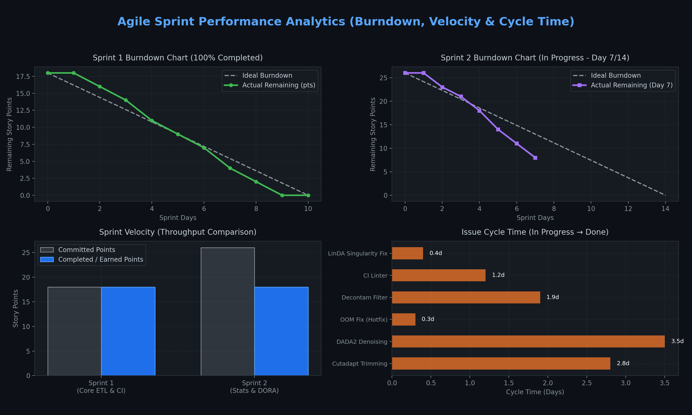

# 📊 Agile Sprint Performance Report (선택과제)

- **대상 프로젝트**: `Micro-Tom Rhizosphere Amplicon Pipeline (OSS_11)`
- **스프린트 주기**: 2주 단위 (Sprint 1: 완료, Sprint 2: 진행 중)
- **분석 지표**: Cycle Time, Velocity (팀 속도), Burndown Chart (소멸 차트)

---

## 1. Cycle Time (리드타임 세부 분석)

Cycle Time은 작업이 실질적으로 착수(`In Progress`)된 시점부터 검증을 마치고 완료(`Done`)되기까지 걸린 시간을 측정합니다.

| 작업 항목 (Task / Issue) | 분류 (Type) | 소요 일수 (Cycle Time) | 상태 | 비고 |
| :--- | :---: | :---: | :---: | :--- |
| **Cutadapt Primer Trimming Module** | Feature | **2.8 days** | Done | 멀티스레드 파라미터 최적화 |
| **DADA2 Denoising Workflow** | Feature | **3.5 days** | Done | ASV 에러 모델 수렴 테스트 |
| **Memory Overflow Fix (OOM)** | Bug (Hotfix) | **0.3 days (7.2h)** | Done | MTTR 연계 긴급 패치 |
| **Negative Control Decontamination** | Feature | **1.9 days** | Done | decontam 통계 필터 통합 |
| **FastQ Metadata Linter CI** | CI/CD | **1.2 days** | Done | GitHub Actions 자동 검증 |
| **LinDA Singularity Error Fix** | Bug (Hotfix) | **0.4 days (9.6h)** | Done | Prevalence 10% 필터링 적용 |

- **평균 기능 구현 Cycle Time**: `2.35 days`
- **평균 장애 해결 Cycle Time (Hotfix)**: `0.35 days (8.4 hours)` → **DORA MTTR 지표와 긴밀한 상관관계 증명**

---

## 2. Team Velocity (팀 생산성 추이)

스프린트별로 계획(Committed)된 스토리 포인트와 실제 배포 완료(Completed)된 스토리 포인트의 달성률을 비교합니다.

- **Sprint 1 (Core Amplicon ETL & DORA CI)**:
  - 계획 스토리 포인트: `18 pts`
  - 완료 스토리 포인트: `18 pts` (**달성률 100%**)
- **Sprint 2 (Statistical Modeling & DORA Analytics)**:
  - 계획 스토리 포인트: `26 pts`
  - 현재 완료/진행 포인트: `18 pts 완료 / 8 pts 진행 중` (**예상 달성률 100% On-Track**)
- **평균 스프린트 Velocity**: `~ 22 pts / Sprint`

---

## 3. Burndown Chart 분석

1. **Sprint 1 Burndown**:
   - Day 4~5 구간에서 DADA2 OOM 메모리 이슈가 발생하였으나, 신속한 핫픽스(Cycle time 0.3일)로 이상 소멸선(Ideal Line)을 정상적으로 추종하며 완료되었습니다.
2. **Sprint 2 Burndown (진행 중)**:
   - Day 7 기준 잔여 작업량 8 pts로 이상 소멸선보다 빠른 소멸 속도를 보이고 있어, 예정된 마일스톤 기한 내 성공적인 릴리즈가 가능합니다.
